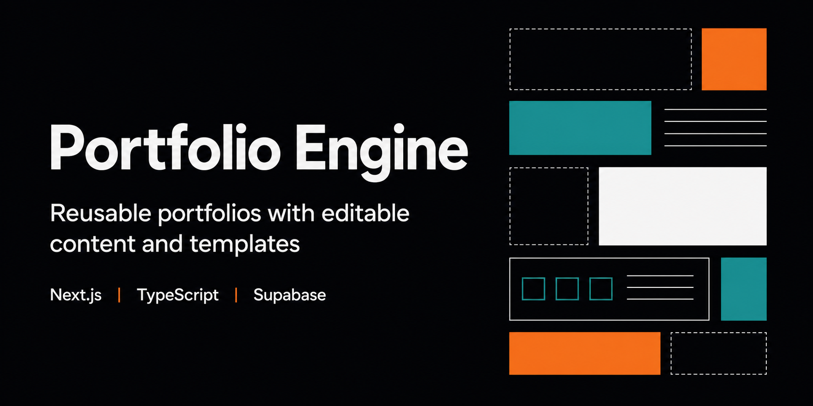
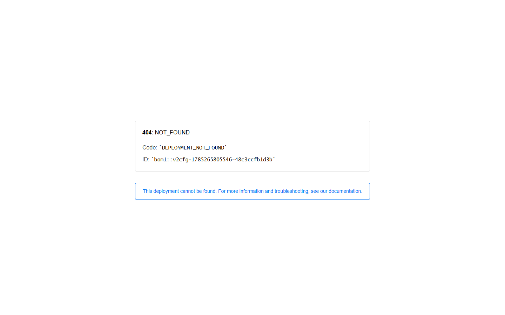
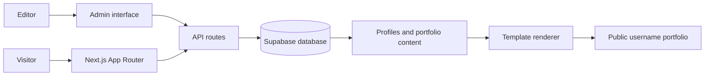

# Portfolio Engine

Multi-template portfolio CMS prototype with editable profiles, projects, skills, certificates, blogs, and sections.



[](package.json)
[](#security-and-limitations)
[](#technology-stack)
[](#architecture)

[Live Prototype](https://portfolio-engine-snowy.vercel.app) | [Screenshot](#screenshot) | [Security](SECURITY.md) | [Production Portfolio](https://itsmebillah.github.io/) | [GitHub Profile](https://github.com/itsmebillah)

## Overview

Portfolio Engine explores a reusable content-management approach to personal portfolios. Users can manage profile details, projects, skills, certificates, sections, templates, and blog content through an administrative interface, then render a username-based public portfolio.

This repository is an experimental predecessor/alternative to the production static portfolio at [`itsmebillah.github.io`](https://github.com/itsmebillah/itsmebillah.github.io). It is useful as a product and CMS prototype, but it is **not production-ready** because authentication, authorization, tests, and lint quality require substantial work.

## Implemented Scope

- Username-based public portfolio route
- Default, split, and tree portfolio templates
- Profile, project, skill, certificate, blog, and section management components
- Administrative and super-admin screens
- Supabase-backed API routes for portfolio content
- Image upload interface
- Template selection and reusable section rendering
- Deployed prototype homepage and demo link

## Screenshot



The public screenshot shows the prototype entry point. Administrative screenshots are intentionally omitted until authentication and authorization are hardened.

## Architecture



## Technology Stack

| Layer | Technology |
| --- | --- |
| Application | Next.js 16, React 19, TypeScript |
| Styling | Tailwind CSS 4 |
| Data | Supabase JavaScript client |
| Uploads | React Dropzone |
| Delivery | Vercel |

## Repository Structure

```text
app/             Pages, admin surfaces, and API routes
components/      Content managers, forms, navigation, and renderers
templates/       Public portfolio layouts and configuration
lib/             Supabase and local authentication helpers
assets/          Screenshots and social-preview artwork
```

## Local Development

```powershell
git clone https://github.com/itsmebillah/portfolio-engine.git
Set-Location portfolio-engine
npm ci
Copy-Item .env.example .env.local
npm run dev
```

Open `http://localhost:3000`.

## Configuration

| Variable | Purpose |
| --- | --- |
| `NEXT_PUBLIC_SUPABASE_URL` | Supabase project URL |
| `NEXT_PUBLIC_SUPABASE_ANON_KEY` | Public key governed by Row Level Security |

No service-role key should be exposed to this client-oriented prototype.

## Verification Status

Available checks:

```powershell
npm run lint
npx tsc --noEmit
npm run build
```

At the modernization baseline, compilation and TypeScript checking can complete with configured Supabase values, but ESLint reports substantial pre-existing type and React-effect debt. No automated test suite exists. See [Security and Limitations](#security-and-limitations) before using the project.

## Security and Limitations

- The login API compares credentials against fields in a custom `users` table rather than using a hardened Supabase Auth session.
- Client-side user state is stored in `localStorage` and is not proof of authorization.
- API authorization and Row Level Security guarantees are not documented or tested.
- Admin and super-admin routes require a complete threat-model and access-control review.
- ESLint reports extensive `any`, effect, dependency, and image-handling findings.
- No unit, integration, browser, or security tests exist.
- Build-time Supabase environment validation is not user-friendly.
- The relationship to the production static portfolio has not been resolved as a product decision.

Do not store real credentials or sensitive portfolio/customer data in this prototype. The recommended visibility is **private until authentication and authorization are replaced and tested**.

## Roadmap

1. Replace custom password checks with Supabase Auth and server-verified sessions.
2. Define and test Row Level Security for every content table.
3. Add route authorization for editor, admin, and super-admin roles.
4. Remove lint debt with shared domain types and safer effects.
5. Add API, browser, and authorization tests.
6. Decide whether this project replaces, supports, or is archived in favor of the static portfolio.

## Contributing and License

Read [SECURITY.md](SECURITY.md) before changing auth, APIs, or admin routes. No open-source license is currently declared; the source is publicly visible, but reuse rights are not granted until a license is added by the repository owner.

---

**Md. Masum Billah** | Data Analyst, Automation Developer, and Business Intelligence Specialist

[Portfolio](https://itsmebillah.github.io/) | [GitHub](https://github.com/itsmebillah) | [Email](mailto:itsmbillah@gmail.com) | [Live Demo](https://portfolio-engine-snowy.vercel.app) | [Documentation](README.md) | [Related: Production Portfolio](https://github.com/itsmebillah/itsmebillah.github.io)
